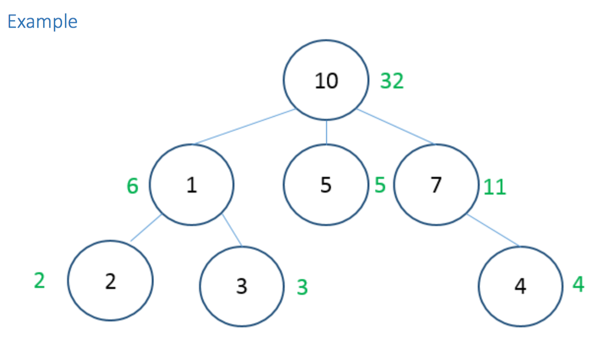
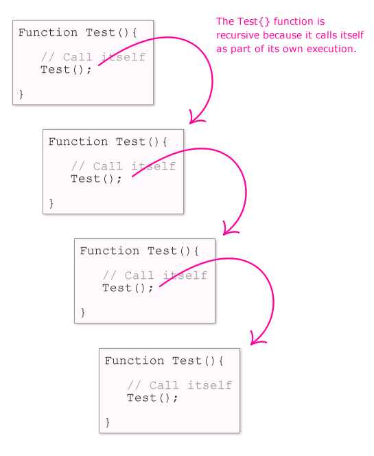

#  Sum of Marbles

> _Create a NEW Android Studio Project_ for this assignent

## The Problem

For this assignment you will implement a class called `Person`. Each person has some number of marbles and some number of children. Implement a function in the Person class called SumMarbles that returns the total number of marbles a person has in addition to the total number of marbles of all of the `Person`’s descendants (hint: they're people, like soylent green).

In an Android application, place the results inside of a `TextView`. You may debug as needed.

In the example below, each circle represents a person, each number inside the circle represents the number of marbles each person has. The numbers in green show the expected output of the SumMarbles function applied to each person.




##### Person Class Starter Code

```java
class Person {
  public int marbleCount;
  public ArrayList<Person> descendants;

  public Person() {

  }

}
```

##### Testing

You'll need to create many instances of _new_ `Person` and add them to an individual `Person`'s `descendants` ArrayList to test this problem appropriately. 

## Recursion

> **WHAT IS RECURSION!?** [Find out on this Stack Overflow post](http://programmers.stackexchange.com/questions/25052/in-plain-english-what-is-recursion)

This problem will require you to implement _recursion_ to solve efficiently. Recursion works by allowing a function to call itself when needed. You can recursively check each `Person`'s children and then have the same function to calculate on them as well.




 Released under the [Creative Commons Non-Commercial License](https://github.com/ga-adi/lab-boilerplate-repository/blob/master/LICENSE)
